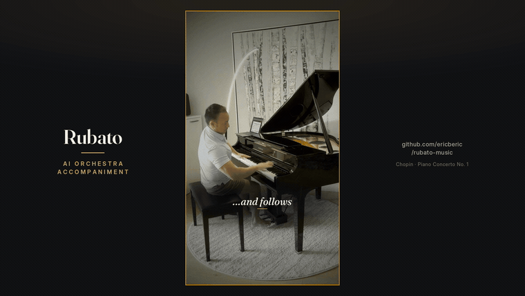
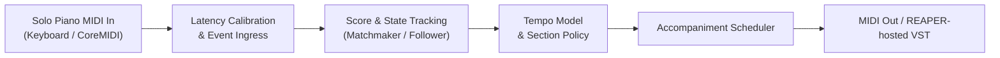

# Rubato

[](LICENSE)
[](https://www.python.org/downloads/)
[](#project-status)

**A local-first, symbolic AI accompanist that plays the orchestra while you play the concerto.**

Rubato listens to a live MIDI piano performance, tracks your position in the
score, estimates your tempo in real time, and plays a synchronized orchestral
accompaniment back to you — the way a human ensemble would follow a soloist.
No cloud, no audio models, no latency budget spent on inference: it works
directly on symbolic MIDI so it can stay fast and run entirely on your machine.

The active target is Chopin's *Piano Concerto No. 1 in E minor, Op. 11*.

<!-- Autoplaying GIF preview (committed GIF); the full sound-on cut below is a
     GitHub user-attachment asset URL, which GitHub renders as an inline player. -->
<p align="center">
  
</p>

<p align="center"><sub><em>▶ an AI orchestra that listens and follows your lead — full 66-second cut, sound on, below · <a href="docs/screenshots/01-ready-stage-current.jpg">rehearsal cockpit screenshot</a></em></sub></p>

https://github.com/user-attachments/assets/d7ec6bee-cb6c-4c58-970b-1ec90239f278

---

## Why Rubato

Playing a concerto alone means playing to a fixed recording that never waits for
you, never breathes with you, and never lets you shape a phrase. A real
orchestra follows. Rubato is an attempt to give a solo pianist that experience
at home:

- **It follows you, not a click.** Score-following and a tempo model keep the
  orchestra with your live playing — speeding up, holding back, and waiting at
  fermatas.
- **It runs on your laptop.** Local-first and symbolic-first. MIDI in, MIDI (or
  hosted-VST audio) out. No account, no server, no raw-audio pipeline.
- **It is built to rehearse with.** Record takes, review alignment, page through
  the score, and iterate — a rehearsal cockpit, not a black box.

> **Project status:** Rubato is an early, single-piece research project built
> around one pianist's rehearsal setup. The offline and replay paths are solid;
> the live FOLLOW runtime works and has a UI trigger but is still labeled
> **experimental / alpha** while timeline mapping and hardware latency are being
> reviewed. See [Project Status](#project-status).

---

## See It

| Ready stage | Rehearsal score | Take capture |
| --- | --- | --- |
|  |  |  |

The **Rehearsal Cockpit** is a local web console: choose your MIDI input/output,
play the orchestra, record free or orchestra-cued solo takes, page through the
score reduction with machine-detected measure boxes, and align/review takes.

---

## How It Works

Rubato runs a deterministic, low-latency symbolic pipeline entirely on the local
machine. It tracks the solo input, estimates score position and tempo, applies a
per-section policy (follow, lead, hold, or stop), and schedules synchronized
accompaniment output.



- **Symbolic-first following** — alignment and tempo tracking run on symbolic
  MIDI streams instead of heavy audio models.
- **Section policy control** — configurable rules for where the orchestra
  follows the soloist, leads, holds, or waits for a cued entry.
- **Dual output routing** — synchronized MIDI to a hardware synth (e.g. a MIDI
  keyboard), or to an external VST host (REAPER with the BBC Symphony
  Orchestra), or both.
- **Run traces** — full telemetry of score position, tempo prediction, output
  latency, and rehearsal feedback for every take.

For the architecture deep-dive, see [docs/SYSTEM_DESIGN.md](docs/SYSTEM_DESIGN.md).

---

## Quickstart

### Prerequisites

- **Python 3.11 or 3.12**
- **[uv](https://docs.astral.sh/uv/)** (recommended) or `pip`
- **Node.js** (to build the web cockpit UI)
- Optional: a MIDI-capable piano and, for live use, an external VST host

### Install

```bash
git clone https://github.com/ericberic/rubato-music.git
cd Rubato
uv sync --extra dev --extra live
```

`--extra live` installs `python-rtmidi` so the backend can see real MIDI ports.
Without it, the device lists are simply empty (the cockpit's Sound Check row
explains this rather than erroring).

### Run

```bash
./scripts/dev-server.sh
```

This builds the web UI, starts the local server, and opens
[http://localhost:8000/app/](http://localhost:8000/app/) automatically on macOS
(other platforms print the URL). Pass `--skip-dvc` or `--skip-build` to opt out
of either step; see `./scripts/dev-server.sh --help`.

Connect your piano before starting, then click **Refresh devices** and pick it
under **Piano input**, and choose an **Orchestra output**.

See the screenshot-driven [Quickstart](docs/QUICKSTART.md) for the full
walkthrough, including hardware configuration and the guarded live-FOLLOW path.

---

## Score & Data Licensing

**The MIT license below covers Rubato's source code only — not musical scores or
MIDI performances.** Handle bundled and downloadable musical assets carefully:

- **Chopin's composition** (Op. 11) is public domain.
- The **Joseffy two-piano reduction** (G. Schirmer, 1918, via IMSLP) is a
  public-domain edition; it is DVC-tracked, not committed to git.
- The **performance MIDI** referenced by the movement-2 bundle is a third-party
  sequence from kunstderfuge.com that permits **private, non-commercial use
  only** and carries redistribution limits. It is **not** an open-source asset:
  it is referenced by a DVC pointer / provenance manifest and is **not**
  redistributed in this repository. Do not redistribute it or works derived from
  it without a separate rights review.

Each score bundle records its provenance and rights in a `source_manifest.yaml`.
Review those before redistributing any asset. See
[docs/OPEN_SOURCE_READINESS.md](docs/OPEN_SOURCE_READINESS.md) for the full
asset-licensing summary.

---

## Project Layout

```text
src/aimusic/
  accompaniment/   Score maps, section policy, scheduling, MIDI routing
  audio/           Live VST/room audio config and rendering
  midi/            MIDI file parsing and stream adapters
  mixing/          Per-zone mix program and control
  realtime/        Streaming follower process and load harnesses
  server/          Local FastAPI + Web MIDI server
  takes/           Take lifecycle, alignment, and review models

webapp/            Svelte rehearsal & performance cockpit UI

docs/
  INDEX.md         Documentation router / LLM wiki index
  PRD.md           Product scope and success criteria
  SYSTEM_DESIGN.md Architecture and data contracts
  concepts/        Core design concepts and algorithms
  runbooks/        Hardware setup and operational procedures

data/              DVC-tracked score bundles and performance maps
runs/              DVC-tracked rehearsal and experiment outputs
```

---

## Development

```bash
uv sync --extra dev        # base, deterministic tests
uv run pytest              # run the test suite

uv sync --extra dev --extra live   # add live MIDI support
uv run pytest -m "live or matchmaker"   # opt-in live/hardware tests
```

List local MIDI devices:

```bash
uv run python -c "import mido; print('in:', mido.get_input_names()); print('out:', mido.get_output_names())"
```

Development principles: MIDI/symbolic first · local execution first ·
deterministic offline tests before live tests · real-time behavior is measured
and logged · human musical feedback is first-class data · prefer proven
score-following packages before custom ML.

---

## Project Status

Rubato is **alpha**. It is a local research instrument built around one
rehearsal setup, not a packaged product.

- **Solid:** offline alignment/render, causal replay of recorded MIDI, the
  rehearsal cockpit (recording, score display, take review), deterministic tests.
- **Experimental:** the live FOLLOW runtime. It is implemented and reachable
  from the UI, but the runtime reports `canonical_position: false` /
  `performance_ready: false` while the semantic timeline, score mapping, and
  hardware latency are reviewed. The living-room / dual-output surround mix is
  explicitly alpha and not performance-ready.

Contributions, issues, and score-following ideas are welcome — please read
[docs/INDEX.md](docs/INDEX.md) first.

---

## Documentation

- [docs/INDEX.md](docs/INDEX.md) — documentation routing table (start here)
- [docs/QUICKSTART.md](docs/QUICKSTART.md) — detailed setup and hardware config
- [docs/PRD.md](docs/PRD.md) — product scope
- [docs/SYSTEM_DESIGN.md](docs/SYSTEM_DESIGN.md) — architectural deep-dive

---

## License

Rubato's **source code** is released under the [MIT License](LICENSE).
Musical scores and MIDI performances are **not** covered by that license — see
[Score & Data Licensing](#score--data-licensing) above.
