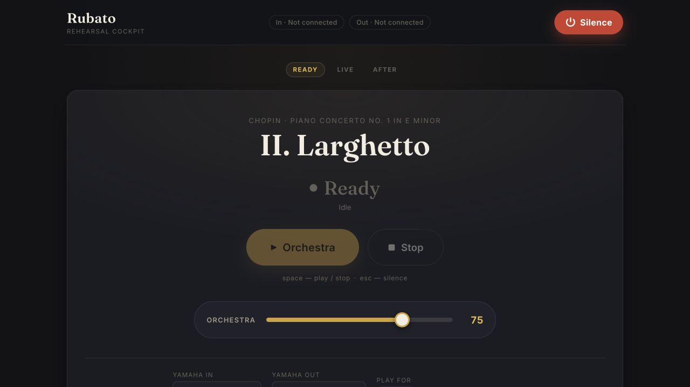
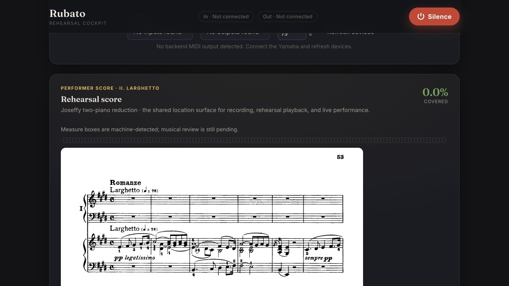
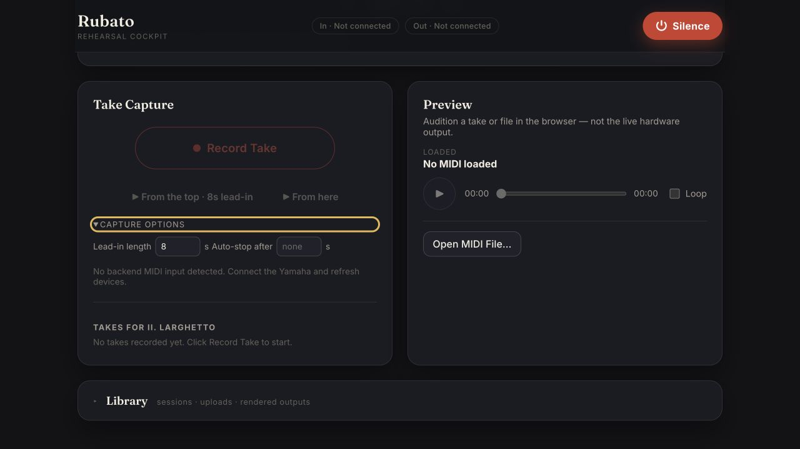

# Rubato Quickstart

Use Rubato to rehearse Chopin Piano Concerto No. 1, Movement 2 with a MIDI
piano / keyboard. Starting the local app is one command. After the browser opens, the
normal rehearsal loop stays in the UI: sound check, record, alignment,
accompanied review, and experimental live following.

## Start Rubato (one command)

Connect your keyboard to the Mac by USB, then run this from the Rubato checkout:

```bash
./scripts/dev-server.sh
```

The script installs the development and live-MIDI
dependencies, pulls the DVC-managed Movement 2 artifacts, builds the web UI
when needed, starts the FastAPI server, waits for it to become ready, and opens
[http://localhost:8000/app/](http://localhost:8000/app/) on macOS. Leave that
terminal window in the background while Rubato is running. There is no second
setup command and no normal mid-rehearsal terminal step.

Use `./scripts/dev-server.sh --skip-dvc` only when the artifacts are already
present and you deliberately want to skip the pull.

## Rehearse in the UI

### 1. Check the keyboard connection



1. Click **Sound** beside **Go live**.
2. Under **Piano input**, select your MIDI keyboard input.
3. Under **Orchestra output**, select **Keyboard speakers** for synth
   playback and take review. For the BBCSO rehearsal route, select **LG
   soundbar · REAPER/BBCSO** instead; this suppresses the keyboard orchestral MIDI
   copy while Rubato sends the four ensemble channels to REAPER. Complete the
   one-time [REAPER orchestra setup](runbooks/reaper-orchestra-host.md) first.

The header pills change from `Not connected` to the selected ports. Empty
dropdowns now explain whether the live MIDI backend is unavailable or the
backend is running but sees no USB ports; checking this no longer requires a
`mido` command in the terminal.

### 2. Set a safe orchestra level

Open **Sound** beside **Go live** and leave **Orchestra** at 75 initially, or
start lower if the soundbar is already loud. This fader is Rubato's master
orchestra level and remains available during a live run. The former timed
Oguri MIDI diagnostic is not part of the live BBCSO path and is no longer on
the primary rehearsal surface.

### 3. Use the performer score



The **Rehearsal score** is the shared location surface for capture, review,
and live following. It is the 15-page Joseffy two-piano reduction for Movement
2. At desktop widths the score page stays on screen beside the rehearsal
controls; you should not scroll away from the music to record or review.

- Click a measure on the engraved PDF (or in the thin 126-measure strip) to
  choose the next take. Uncovered piano measures are hatched; the suggested
  next gap is selected automatically after each take.
- Click the **left/right arrows** below the page to move one page at a time.
- Open **Coverage by measure** below the PDF to inspect the measure grid.
- Follow the continuously scanning score-position cursor during an orchestral
  lead-in, accompanied review, or live following. Rubato turns the page with a
  0.75-second lookahead. The latest performed take span is marked separately.
- The current boxes and score-time mapping are machine-detected and labeled as
  awaiting musical review. They are useful rehearsal coordinates, not claimed
  canonical measure identities.
- **Observed** reports how much of the solo part has appeared in at least one
  kept take. One take paints a passage amber/touched and makes Observed nonzero;
  green/covered remains the stricter repeated-take target (three by default).
  The latest-take marker and accumulated coverage are intentionally different
  layers.

### 4. Record and place a passage



1. Click the measure where the pass should start.
2. Read the **This pass** plan before recording. With **Orchestra cue** on it
   names the bars the orchestra leads, the exact measure/beat where Rubato
   begins following, prior-take support there, and the learned tempo.
3. Click **Record pass**. The orchestra and causal follower start at the
   selected measure; enter according to the printed score. The same keyboard
   notes correct the follower and are captured automatically.
4. Click **Stop Take**, or press **Space**.
5. Use the sticky recording card to **Hear recording**, **Keep as rehearsal
   take**, or choose **Nothing for now**. Only Keep adds the performance to the
   rehearsal evidence.
6. After Keep, continue reading the score while Rubato places the take. The take moves
   from captured/running to aligned, ambiguous, unalignable, or failed.
7. If it is ambiguous, choose the displayed candidate location. Discard and
   restore remain reversible decisions about whether the take should influence
   the rehearsal profile.

Turn **Orchestra cue** off before step 3 for an immediate solo recording; only
the keyboard input is required in that case. With no score selection, the free
recording action remains available.

Alignment is background work with durable job state. Refreshing or reopening
the page does not redefine the take lifecycle.

### 5. Review that take with the orchestra

Rubato continues automatically after an aligned take:

```text
Stop Take
  -> explicit Keep as rehearsal take
  -> automatic alignment
  -> automatic accompanied-review preparation
  -> one Hear take + orchestra action
  -> Go Live or Record another take
```

The **After this take** card says the take is **in the bank**, then shows
**Placing it in the score…** and **Preparing orchestra playback…**. When it is
ready, the placed span remains marked on the visible score:

- Click **Hear take + orchestra** to play the recorded piano and retimed
  orchestra together through the output selected during Sound Check.
- Click **Preview here** to load the same combined review into the browser
  player.
- Click **Solo only** when you want to isolate the recorded piano.
- Click **Record another** to continue taking passages, or **Go live ·
  Experimental** to try the causal follower with the same ports.

If preparation fails, the card preserves the take and alignment and offers
**Retry orchestral review**. An ambiguous take asks you to choose its location
before Rubato prepares the orchestra. This entire handoff is take-native and
restart-safe; you do not create a session slot, upload the take again, copy an
ID, or run `rubato render-offline`.

### 6. Verify accompanied recording on the keyboard

This requires both MIDI input and output.

1. Optionally open **Capture options** and set **Auto-stop after**. Leave it
   empty for manual stop.
2. Select m. 9 and leave **Orchestra cue** on. Confirm the plan says the
   orchestra leads into the first piano pickup, follows from m. 12 beat 4, and
   shows the learned tempo.
3. Click **Record pass**—this is the recorded causal-follower path. Listen for
   the cursor and orchestra to correct to the piano after the pickup instead of
   continuing on a fixed clock.
4. Click **Stop Take** or press **Space** when finished.
5. Click **Keep as rehearsal take** for a pass you want Rubato to learn from;
   choose **Nothing for now** to leave it as scratch debugging evidence.

For the interlude check, play through m. 22: the orchestra should enter `LEAD`
through the written piano silence without reporting a dropout. In a separate
pass, stop playing mid-phrase where the piano is expected; that silence should
register a dropout. This same input contrast is pinned by
`tests/accompaniment/test_expectation.py`.

### 7. Go live (experimental)

The **Go Live** panel is wired to the streaming Matchmaker follower, causal
scheduler, optional keyboard renderer, configured live-audio zones, and runtime
status stream. It reuses the input and output choice from sound check; there
are no port names to re-enter. Rubato proactively records the performance as
ephemeral debugging evidence. After stopping, hear it, keep it as a rehearsal
take, or do nothing.

1. Confirm **Piano input** is selected and no recording or playback job is
   active. Choose **Keyboard speakers** for keyboard orchestral MIDI, or **LG
   soundbar · REAPER/BBCSO** when REAPER should own the orchestra audio.
   Local Control is a setting on the digital piano, not in Rubato; leave it on
   so the solo piano continues through its natural speakers.
2. Click **Go Live**.
3. Begin with a short 30–60 second passage.
4. Watch the state word change among `Listening`, `Following`, `Leading`,
   `Waiting`, and `Silent`.
5. Click **Stop Live** to end normally, or **Silence**/**Escape** to stop and
   send MIDI panic immediately.

The visible **Experimental** badge is intentional. Movement 2 still reports
`canonical_position: false` and `performance_ready: false`; this test is for
hardware, follower, scheduler, and safety behavior, not concert readiness.

### 8. Emergency controls

- **Escape** or the red **Silence** button: stop the live runtime and active
  hardware work, then send all-notes-off/all-sound-off.
- **Space**: run the situation's primary action—stop the active take, cancel a
  lead-in, stop orchestra playback, or start playback when idle.

Use **Silence** immediately if notes stick, playback sounds wrong, or a
hardware job appears stuck.

## End the session

Open **Library**, click **End session**, and confirm. Rubato stops the local
server after returning the response. Closing the browser tab by itself does
not stop the server.

Pressing **Control-C** in the original terminal remains a fallback, not a
required part of the at-piano workflow.

## Troubleshooting

- **Score-artifact warning:** normal startup already runs `dvc pull`. If you
  deliberately used `--skip-dvc`, end the session and restart without that
  flag. The Ready-face banner lists missing artifacts instead of failing
  silently.
- **No MIDI devices:** reconnect USB, close other apps that may hold the port,
  and click **Refresh devices**. The in-app explanation distinguishes a
  missing live backend from a running backend that sees no ports.
- **Buttons stay dim:** free takes need input; orchestra playback, cued takes,
  take review, and calibration need a real MIDI output. Go Live needs input and
  either a MIDI output or a configured live-audio zone.
- **No sound:** for keyboard playback, confirm the keyboard MIDI output and synth volume.
  For REAPER Go Live, confirm the PWA reports Ready, the Rubato bridge heartbeat
  is fresh, REAPER itself names the LG output, and Rubato's Orchestra volume is
  audible. See the [REAPER host runbook](runbooks/reaper-orchestra-host.md).
- **Take cannot be placed:** choose a candidate when Rubato reports ambiguity;
  otherwise keep the raw take and use the visible retry/error path.
- **Orchestral review failed:** click **Retry orchestral review**. The raw take
  and successful alignment remain intact.
- **Stuck note:** press **Escape** or click **Silence**.
