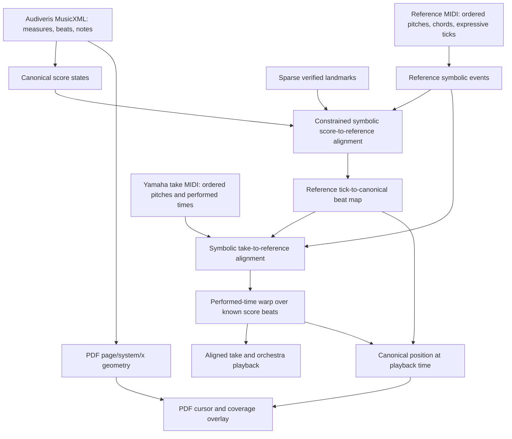
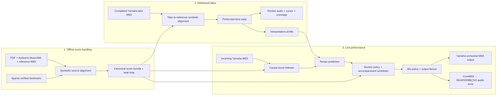
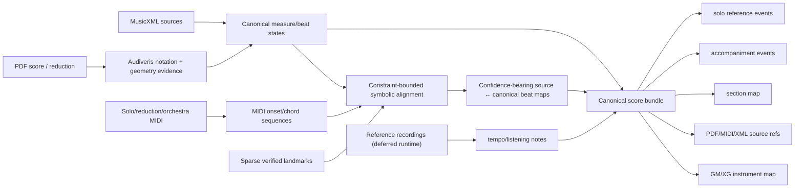
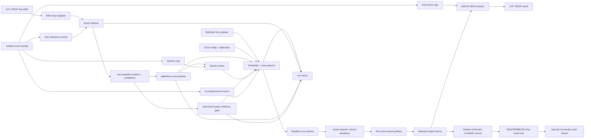

# System Design - Live Accompanist MVP

## Architecture Summary

Rubato has three workflows with one shared canonical score coordinate:

1. **Offline score bundling** turns the PDF, Audiveris MusicXML, and reference
   MIDI into a reusable symbolic bundle and source-to-score beat map.
2. **Rehearsal takes** align completed Yamaha recordings to that bundle,
   produce review/coverage artifacts, and learn Eric's interpretation profile.
3. **Live performance** follows incoming Yamaha notes causally against the
   bundle, combines that position with the frozen rehearsal profile, and emits
   symbolic accompaniment in real time to Yamaha MIDI, configured VST audio
   zones, or both.

Rehearsal and live performance reuse the same follower, tempo, policy,
scheduler, MIDI adapters, and trace contracts where possible. They remain
different workflows because rehearsal is allowed to revise derived knowledge
after a take, while live performance must use already-prepared knowledge and
cannot wait for offline alignment.

The runtime scheduler needs both canonical score position and timing state.
Tempo is a rate; score position is the global location. Bundle v2 persists
exact integer `score_tick` and projects it to measure label/beat for human
communication. Existing `score_beat` runtime fields are a migration view, not
the durable identity.

Timing authority is evidence-weighted over one transport. The rehearsal profile
supplies a canonical beat-period/phase prior and variance; the live follower
supplies observed position, tempo, confidence, and phase error. Section policy
modulates their relative precision. Structural `FOLLOW` and `LEAD` regions are
the current endpoint representation, while handoffs use the pianist's arrival
phase and the orchestra's outgoing tempo prior. Normal phase disagreement is
corrected gradually and must not become a skip panic.

### The inference ladder

The shortest useful mental model is **identity first, correspondence second,
timing third, pixels last**:

1. The symbolic score defines *what musical location exists*: movement,
   measure, beat, voice, and pitches.
2. Ordered pitch/chord matching determines *which reference-MIDI events express
   that location*.
3. Ordered pitch/chord matching determines *which notes in one take express
   those reference events*.
4. Only then does the take's clock determine *when those identified locations
   happened* and how much rubato occurred between them.
5. The score location is finally projected through Audiveris geometry to answer
   *where to draw the cursor on the PDF*.

This ordering prevents a long beat from looking like an extra measure and a
short beat from skipping one. Time may stretch the distance between two known
musical locations; it cannot decide which notes or measures they are.



The arrows are dependency claims. PDF pixels do not infer score time. MIDI
ticks do not infer measure numbers by duration. Human corrections do not
become a second score. Each merely contributes evidence to the next declared
inference.

### What each source knows

| Source | Strong evidence | Does not know by itself |
| --- | --- | --- |
| Audiveris MusicXML | Notated measures, beats, pitches, voices, and engraving geometry | How the Oguri or Eric performance stretches time; recognition may contain errors |
| Oguri reference MIDI | Ordered notes/chords and one expressive performance clock | Printed bar numbers or PDF coordinates |
| Yamaha take MIDI | Eric's ordered notes, dynamics, pedal, and performed timestamps | Its canonical score location without alignment |
| Sparse human landmark | One high-confidence local correspondence | The neighboring measures or a whole-piece timing model |
| Canonical timeline | Stable internal measure/beat identity | Which source event or wall-clock instant realizes it |

Confidence belongs to correspondences, not to the canonical coordinate. A
measure can exist canonically even when no source event has yet been mapped to
it.

## Three-Workflow Architecture



The workflows form a dependency chain, not three peer clocks:

```text
score bundle (piece knowledge)
  -> rehearsal alignments and profile (Eric-specific prior)
  -> live performance (causal position + prior -> accompaniment)
```

Raw takes and live traces remain source artifacts. Bundle maps, take warps,
coverage, profiles, and cursor transports are derived and may be rebuilt from
their declared inputs.

## Offline Score Bundle Flow



The PDF is not the runtime representation. The runtime uses symbolic,
beat-indexed events and keeps PDF page/system/measure references as metadata.

Movement II's build makes that boundary concrete. Full Audiveris recognition
supplies MusicXML notes and engraving x/y evidence. Sparse performer-verified
landmarks constrain an ordered symbolic alignment: Joseffy Piano I pitches and
chords align to the Oguri solo, while Piano II pitch-class/harmonic sequences
bridge orchestra-only regions. The symbolic path—not elapsed MIDI time—assigns
measure and beat identity. The derived beat map then attaches expressive source
ticks/seconds and PDF x to each substantiated canonical beat. Audiveris and
sequence alignment remain offline build operations.

## Realtime Performance Flow



The opening does not always originate at `YamahaIn`. Section policy owns the
initial authority:

```text
LEAD opening: performance-profile base tempo + first accompaniment event
  -> monotonic score clock -> orchestra begins -> Waiting at solo entry
  -> symbolic Yamaha lock -> FOLLOW

FOLLOW opening: Yamaha notes -> symbolic lock -> FOLLOW

later LEAD: symbolic arrival at authored boundary -> autonomous orchestra clock
  -> exclusive section end -> buffered/next symbolic Yamaha re-entry -> FOLLOW
```

For Movement II, the bundle's `derived/sections.json` declares measure 1 through
the measure 12 beat-4 pickup as the opening `LEAD` region, measure 22 as the
first later `LEAD` interlude, and the continuations around measures 52 and 104.
The runtime never recreates these semantic boundaries by rounding MIDI note
releases. Rehearsal takes currently
contribute the robust starting BPM; they do not train a separate pitch follower.
The symbolic solo reference and incoming Yamaha pitches determine live
location. This keeps the inference sequence consistent with the ladder above:
authored section identity, prior timing, then live symbolic evidence.

## Components

| Component | Responsibility |
| --- | --- |
| Score bundle | Versioned symbolic source of truth: solo, accompaniment, sections, refs, instruments |
| MIDI input adapter | Reads live Yamaha MIDI, Web MIDI bytes, or recorded replay |
| Score follower | Estimates current score beat from incoming solo events and the solo reference |
| Position stabilizer | Preserves symbolic advances and repeats while clamping sub-measure backward jitter for cursor/scheduling |
| Tempo/timing model | Admits meaningful beat/time baselines, rejects chord-note spikes, and smoothly updates beat timing |
| Section policy | Chooses `FOLLOW`, `LEAD`, `HOLD`, or `STOP` by score region and confidence |
| Mix program | Independent reviewed authoring artifact with piece-wide route defaults, sparse score regions, zone/stem gain envelopes, and fallbacks |
| Mix policy compiler | Validates the selected mix program against one score timeline, zone configuration, and calibration revision, then freezes a per-run policy snapshot |
| Scheduler + zone planner | Resolves score events and mix control points into generation-stamped zone actions, then transfers each at its policy-gated commit deadline |
| Deadline output | Owns each zone's locked prefix, waits independently of follower work, enforces local panic barriers, and applies revisioned measured advance |
| Renderers | Convert accompaniment events into Yamaha MIDI or four-channel CoreMIDI for REAPER/BBCSO; a run may use either or both |
| MIDI output adapter | Sends MIDI to CLP-795GP, IAC, Logic, Kontakt, or file |
| PWA/backend | Provides setup, transport controls, status, feedback, source prep, and review |
| Trace logger | Queues score position, tempo, authority generation, per-zone commit/advance/calibration/fallback, output latency, and user feedback for bounded asynchronous JSONL writing |

## Data Contracts

### Score Bundle v2

See [Score Bundle v2 Contract](concepts/score-bundle-contract.md) for the strict
Pydantic schemas, mapping rules, and workflow readiness checks.

- `bundle.yaml`: identity, explicit source/derived roles, mapping references.
- `source/`: semantic score, display engraving, expressive playback, evidence.
- `derived/timeline.json`: exact score ticks and measure/meter projection.
- `derived/*_map.json`: partial source correspondences and explicit gaps.
- `derived/performance_beat_map.machine.json`: beat-level reference MIDI ↔
  canonical timeline ↔ PDF geometry, with evidence and confidence.
- `derived/`: follower reference, accompaniment, sections, instruments.

The current five-file event `ScoreBundle` remains behind
`LegacyScoreBundleAdapter` while follower/scheduler callers migrate.

### Score Position

```json
{
  "movement_id": "2",
  "score_tick": 184320,
  "measure_index": 64,
  "measure_label": "65",
  "offset_ticks": 480,
  "beat_in_measure": 0.5
}
```

`score_tick` is exact and sortable. Printed measure labels are not assumed to
be numeric or unique. A source MIDI tick, PDF page coordinate, and take second
become score positions only through their declared mappings.

### Coordinate ownership

Canonical `score_tick` owns musical identity. Reference MIDI tick/seconds,
take seconds, MusicXML divisions, and PDF coordinates are retained as evidence
and diagnostics. Take alignment is MIDI-to-MIDI, then matched reference ticks
are converted once to canonical ticks. Review audio, coverage, the red cursor,
and PDF x interpolation consume that same persisted map. Runtime code must not
re-project a canonical tick through the reference map a second time.

### Inference ownership

Coordinates and inference signals have separate owners:

- canonical notation owns measure/beat identity;
- ordered symbolic correspondence owns which reference MIDI event represents
  that identity;
- take-to-reference symbolic alignment owns which performed notes represent
  the reference events;
- the fitted timing map owns when those already-identified events occur;
- Audiveris/PDF geometry owns where an already-identified score position is
  painted.

Timing is downstream of symbolic identity. Tempo, rubato, and wall-clock gaps
may shape the warp between anchors but cannot advance, insert, or relabel a
measure. Sparse human input constrains ambiguous paths; it does not replace the
automatic sequence alignment with exhaustive labeling.

### Performance profile coordinate and parameters

The interpretation profile is downstream of the canonical take warp. It is
not another score follower and it never stores reference-MIDI beat positions.
Performance-profile v2 uses:

```text
canonical_ppq = 960
grid_step_ticks = 480  # half of one notated quarter

per take:
  base_seconds_per_quarter
  cell(score_tick):
    seconds_per_quarter
    rubato_ratio = seconds_per_quarter / take baseline
    velocity, pedal, alignment quality

across takes at each score_tick:
  quality/recency-weighted median
  weighted median absolute deviation
  support and mean quality
```

`seconds_per_quarter` retains absolute pace. The dimensionless
`rubato_ratio` retains local phrase shape after removing a take's global tempo.
That separation lets the performer set one conventional quarter-note
metronome mark (`♩ = N`) for the whole performance without flattening Eric's
learned broadening or compression. The web/API boundary uses absolute BPM;
each autonomous section converts its canonical quarter span into a target wall
duration and derives the internal reference-clock period from the corresponding
reference span. The internal value is never presented as notated BPM. Integer
`score_tick` is the only cell key; floating `beat`, source MIDI tick, and the
former ambiguous `period_s` are not runtime profile coordinates.

The v2 fold reads only canonical `aligned.v2.json` artifacts. The pre-v2 fold
read `aligned.json`, so it could accidentally learn on expressive reference
MIDI coordinates while review and cursor code used canonical score time. A
one-time migration rebuilt each cell from raw `take.mid` plus the canonical
timing map, replaced `profile.json`, and left recovery-only backups. There is
no runtime fallback to the old profile schema.

This first model intentionally learns timing, velocity, and pedal only. The
canonical take alignment already contains enough note correspondence to add
research-standard descriptors—log articulation ratio, chord spread, and
within-chord melody landing offset—without changing the coordinate model.

### Build-time versus per-take inference

The expensive score-source reasoning happens once per score-bundle revision:

```text
PDF + Audiveris MusicXML + reference MIDI + sparse corrections
  -> performance_beat_map.machine.json
```

That artifact is reusable across every rehearsal. A new take performs only the
second alignment and timing fit:

```text
Yamaha take MIDI + reference MIDI + performance beat map
  -> matched symbolic anchors
  -> take-time <-> canonical-score-time warp
  -> review transport, coverage, cursor, and accompaniment render
```

All four review outputs consume the same take timing map. They must not each
infer score position independently; otherwise aligned audio can be correct
while the cursor is wrong.

### Worked example: Movement II measure 46

The old calibration selected Oguri native tick `107926` as the start of m.46.
That event is a solitary pitch 54 inside the preceding phrase. Audiveris reads
the opening of m.46 as the chord `[47, 63, 71]`; ordered symbolic matching finds
that chord at Oguri ticks `109900..109915` and assigns the median tick `109912`
to the downbeat. The following m.47 correspondence is `112160`.

The important point is not those particular numbers. The repair comes from the
dependency order: score chord identity selects the MIDI event, and the event's
tick supplies timing afterward. Choosing a visually plausible MIDI onset first
and naming it “m.46” reverses that inference and can be one bar wrong.

### Event Row

```text
event_id
measure
beat
part_id
voice_or_staff
pitch_or_rest
duration_beats
notated_dynamic
articulation
source_refs
```

### Follower Update

```json
{
  "perf_time": 12.345,
  "score_beat": 184.5,
  "confidence": 0.83,
  "raw_state": {}
}
```

`ScoreFollower` is the plug-in seam. `OracleFollower` implements the same
interface for deterministic simulations where the true score beat is known.
Matchmaker should later implement this seam for live or replayed MIDI.

### Scheduler Input

```json
{
  "score_beat": 184.5,
  "confidence": 0.83,
  "tempo_bpm": 76.0,
  "beat_period_seconds": 0.789,
  "section_mode": "FOLLOW"
}
```

### Spatial Mix Region And Zone Action

The canonical contract separates musical mix intent, tracking data, and device
calibration. A reviewed `MixProgram` lives outside the immutable bundle and
take-derived Interpretation, references one exact score-timeline digest, and
owns piece-wide default routes plus sparse `MixRegion` overrides. Each route
names stems, a zone, `0..100` level/envelope, and fallback. The program pins a
level-mapping revision that compiles those user values into renderer-specific
audio gain or MIDI CC7. A `ZoneConfig`
independently owns renderer/device identity, channel map, acoustic position,
measured latency distribution, selected advance, calibration revision, health,
and anchor fallback.

At run start, the selected program and zone/calibration revisions compile into
an immutable `MixPolicy` snapshot. Rehearsal coverage, `anchors.json`, and human
alignment corrections are neither inputs to authoring visibility nor writable
through mix mode.

The implemented Movement-II path snapshots a selected, current-score program
before opening outputs. The transport clock evaluates `yamaha_anchor`
automation independently of note attacks; only changed quantized values are
sent, so held notes follow swells. Exact part routes override the orchestra stem.
Levels multiply the independent live master volume and authored instrument-map
value before becoming channel CC7; source note velocity is unchanged. The
REAPER route applies that same quantized policy on the four ensemble channels;
source note velocity remains unchanged.

`room_center` is admitted when its machine-local binding names the installed
REAPER app/project and the pinned mix program routes an audible stem to it. The
current PWA may therefore fan out to Yamaha and REAPER/BBCSO, or run
REAPER/BBCSO-only when the performer explicitly chooses no Yamaha MIDI output.
Dynamic readiness additionally requires the fresh REAPER bridge heartbeat and
exact LG output. It does not prove acoustic calibration, dense-tutti stability,
or rehearsal-length performance.

Mix storage uses inter-process file locks plus optimistic revisions. Artistic
revisions record an explicit Undo parent. A score digest mismatch marks a
program stale without hiding it; edit/live operations fail closed until a human
reviews its coordinates and explicitly rebinds it to the current score.

The scheduler and zone planner combine those artifacts with the arrival-time
curve into `ScheduledZoneAction` records. Each action retains the source
event/control identity, intended acoustic time, zone, configured advance,
deadline, mix-region identity, fallback, and existing `authority_generation`.

The direct-HDMI MVP admits only zones whose configured advance and residual
spread fit the ordinary 100 ms dispatch contract. Yamaha and soundbar actions
therefore share one normal ownership-transfer boundary while their deadline
outputs emit at different compensated times. Slow-zone, action-specific
commitment is deferred rather than encoded in every musical region. See
[Calibrated Low-Latency Spatial Mixing](concepts/psychoacoustic-spatial-mixing.md).

### Rehearsal Run

`runs/<run_id>/`

- `trace/runtime.jsonl`: typed input, raw/stabilized follower, tempo decision,
  policy transition, accepted performer controls, scheduler authority
  generation/target/commit, expired-event IDs, adapter note-on/note-off timing
  and velocity/CC, panic, and state records. Runtime producers enqueue these
  rows; a bounded non-realtime writer owns JSON serialization and filesystem
  append.

`scripts/analyze_live_trace.py` finds the latest actual `live-*` run when called
without arguments (or accepts `--run-id`) and joins its runtime journal with
the cursor trace, captured solo MIDI, and scratch-take marker. It compiles that
journal into follower jitter and latency, tempo admissions/rejections, section transitions, MIDI dispatch
lateness, actual output-adapter onset/release lateness, input/orchestra velocity,
applied controls, and panic summaries. Raw traces remain authoritative for
event-level reconstruction. See the
[Live Run Forensics runbook](runbooks/live-run-forensics.md).

### Rehearsal Diagnostic Journal

The local server appends every typed lifecycle publication to
`data/logs/rehearsal-events.jsonl` before attempting WebSocket delivery. Each
JSON Lines envelope adds a UTC `recorded_at`, unique `event_id`, `event_type`,
and available piece/movement/take/session/run/job correlation fields around the
original event payload. Browser connectivity therefore has no bearing on the
diagnostic record; the socket remains a live notification channel with REST
recovery, not a replay API.

Background hardware, alignment, resolution, accompanied-review, profile, and
coverage exceptions append records to the same journal with their exception
type, message, traceback, and correlation fields. Journal writes are
best-effort and may never block or fail recording, playback, or analysis. The
durable job/take artifacts remain authoritative state; this journal supplies
the ordered cross-component timeline that links those artifacts when debugging.
Sparse in-app beat corrections append `score:alignment_corrected` with source
seconds/tick, canonical tick, measure/beat, mapping revision, and affected take.

## Runtime Modes

### Offline Render

Use recorded solo MIDI to render accompaniment. This is the first target because
it avoids live I/O and makes debugging deterministic.

### Simulated Online

Replay a recorded MIDI take through the real-time path at original timing. This
validates causal behavior while preserving reproducibility.

The first simulated-online tests use `OracleFollower` to isolate scheduler and
tempo-model correctness before testing probabilistic score-following errors.

### Live

Read Yamaha MIDI input and emit symbolic accompaniment to the CLP-795GP
internal synth, a configured REAPER/BBCSO audio zone, or both. A REAPER-only
orchestra run keeps Yamaha Local Control on for the soloist's natural speakers
and omits the orchestral MIDI output to the Yamaha.

## Dependency Strategy

- Use Matchmaker as the first score-following wrapper.
- Treat ACCompanion as reference architecture for live accompaniment behavior.
- Treat HeurMiT as research-only until neural score following is more robust.
- Keep base dependencies light for tests and server work.
- Add real-time packages behind an optional `live` extra.
- Keep Yamaha GM/XG as the reliable fallback. The accepted experimental quality
  upgrade is machine-local REAPER/BBCSO behind one virtual CoreMIDI source.
- Keep REAPER's four BBCSO instances resident and let its real-time engine own
  audio. Preserve deterministic virtual-port/heartbeat tests and hardware-gate
  memory, dense-tutti, latency, and long-run acceptance
  ([Decision 0019](decisions/0019-reaper-external-orchestra-host.md)).
- Use a calibrated direct-HDMI room zone inside the normal 100 ms dispatch
  contract. Author piece-wide route defaults plus sparse spatial/envelope
  overrides; keep device advance in `ZoneConfig`, not the score
  ([Calibrated Low-Latency Spatial Mixing](concepts/psychoacoustic-spatial-mixing.md)).
- Treat Magenta RealTime 2 as deferred neural-audio rendering research, not as a
  replacement for score following or deterministic accompaniment scheduling.

## Failure Modes To Design For

- Soloist pauses unexpectedly.
- Soloist skips or repeats a measure.
- Wrong notes or extra flourishes in dense passage.
- Long solo silence before orchestra entrance.
- Follower confidence drops near repeated patterns.
- MIDI device disconnect.
- Output route unavailable.
- Zone latency calibration is stale, its residual spread is unstable, or its
  required advance exceeds the normal live dispatch horizon.
- A skip, repeat, or panic occurs after audio has entered a downstream device
  FIFO and the accepted physical tail still sounds.
- Fallback would create a mid-gesture timbre tear; defer it to the next reviewed
  boundary when immediate silence is not required.
- Score source has incorrect repeats or part splits.

The system should log failures clearly before trying to be musically clever.

## Related

- [Realtime Performance Dataflow](concepts/realtime-performance-dataflow.md)
- [Simulated Online Harness](concepts/simulated-online-harness.md)
- [Score Bundle Ingestion](concepts/score-bundle-ingestion.md)
- [PWA Rehearsal UI](concepts/pwa-rehearsal-ui.md)
- [Decision 0002](decisions/0002-tracker-and-synth-mvp.md)
- [Decision 0003](decisions/0003-magenta-rt2-renderer-research.md)
