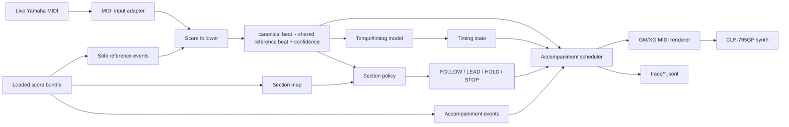
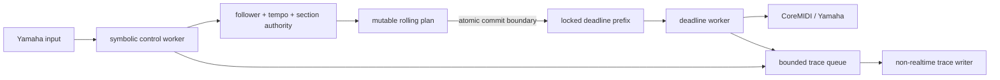

# Realtime Performance Dataflow

## Summary

During performance, Rubato runs as a causal loop. It loads a score bundle before
playback, listens to Eric's live MIDI, estimates score position and timing, then
schedules accompaniment MIDI slightly ahead of audio time.

The accompaniment scheduler needs two related coordinates plus timing:

- canonical `score_beat`: musical identity for measure/beat and the cursor.
- `reference_beat`: the expressive Oguri MIDI coordinate shared by the split
  solo reference and orchestra accompaniment.
- `tempo_state`: current beat period, smoothed tempo, acceleration, confidence.
- `section_mode`: whether to follow, lead, hold, or stop.
- `accompaniment_events`: future notes from the score bundle.

Tempo alone is not enough. A tempo of 88 BPM says how fast time is moving; it
does not say whether the system is at measure 1, 120, or 300.

## Realtime Diagram

## Mistakes, Skips, Rubato, And Flourishes

The score follower is the component that pays attention to notes, including
wrong notes, skipped notes, extra notes, and rubato. Off-the-shelf followers do
this by comparing incoming observations against the loaded solo reference:

- HMM-style methods model likely score states and insertions/errors.
- OLTW-style methods causally align a live sequence to a reference sequence.
- MIDI processors can group chord notes, use pitch-only features, pitch-class
  features, or piano-roll windows.

The scheduler should not directly interpret note mistakes. It consumes the
follower's best estimate plus confidence. A sub-threshold update never trains
the tempo model: the engine coasts briefly from the last trusted timing state,
then enters `HOLD` if lock does not recover.

Position and tempo are different inferences. A chord can cause several symbolic
position updates a few milliseconds apart; that is strong pitch/location
evidence but invalid beat-duration evidence. Rubato clamps small backward
position jitter for the performer-facing cursor and only admits a tempo sample
after at least half a notated quarter and 120 ms of joint score/time progress.
Implausible samples are rejected, and accepted beat-level periods are
exponentially smoothed at the configured response rate. A large backward move is
still preserved as a repeat rather than hidden as jitter.

## Startup Behavior

Before Eric starts playing, Rubato loads:

- score bundle version
- excerpt start beat
- solo reference events
- accompaniment events
- section map
- output instrument map
- selected MIDI input/output devices

The REAPER/BBCSO route has an explicit asynchronous, resident readiness
lifecycle. By default the PWA requests connection at mount rather than waiting
for `Go live`. Rubato opens one CoreMIDI virtual source named `Rubato Orchestra`;
REAPER owns four channel-filtered BBCSO tracks and the CoreAudio stream. A
deferred Lua bridge publishes an atomic heartbeat containing project identity,
MIDI input, four-track FX health, audio-engine state, output device, sample
rate, block size, and output-latency samples. Only a fresh, fully matching
heartbeat becomes `ready`. `Go live` leases the already-open virtual MIDI
router and returns it after the run. Disabling **Keep REAPER ready**, explicit
unload, or server shutdown closes Rubato's virtual MIDI source, not REAPER.

The router maps the existing four memory-bounded ensemble groups to channels
1--4 and reuses `DeadlineAccompanimentOutput` plus `MidoAccompanimentOutput`.
Rubato therefore owns immutable note-on deadlines, note-off lifetimes,
retrigger release, CC7 volume/mix automation, and panic while no audio block
crosses Python, multiprocessing, or PortAudio. REAPER owns plug-in scheduling,
mixing, and the real-time CoreAudio callback.

Renderer progress and failures publish as typed `runtime:renderer_status`
events; the standalone lifecycle is durably traced under
`runs/renderer-preload-*/trace/renderer.jsonl`. Static zone health proves only
that REAPER and its project exist. Dynamic readiness comes exclusively from the
fresh bridge heartbeat. Yamaha MIDI readiness is a separate route and never
waits for this renderer.

An automatic request is idempotent while loading/ready and circuit-broken after
`failed` or `unavailable`. A browser reload therefore observes the existing
failure instead of reopening ports in a loop. The explicit UI Retry is a forced
request. The legacy Pedalboard worker remains available for rollback and
offline diagnostics; see Decision 0019.

Startup follows section policy rather than assuming the pianist always begins:

- With no selected measure, opening behavior is unchanged. A `FOLLOW` opening
  listens for broad follower lock; a `LEAD` opening starts the orchestra at its
  first sounding event.
- With a printed measure selected, the server resolves measure -> canonical
  960-PPQ beat -> reference-performance beat exactly once. A four-quarter
  count-off uses the selected section's authored tempo (or the run tempo), and
  `runtime_start` records both coordinates plus their shared future monotonic
  downbeat. Count-off notes use the device adapter's explicit configurable cue
  channel (Yamaha/GM percussion channel 10 by default), volume, lock, and output
  trace rather than writing raw MIDI or borrowing an orchestral part. The engine is seeded
  during the last count-off quarter so its entry deadline can commit before
  sounding.
- A selected `FOLLOW` entry warm-starts Matchmaker's PTHMM prior in the reference
  coordinate and requires two stable onsets for lock. Its authored count-off
  phase is an explicit confidence-zero timing seed, not a synthetic follower
  observation. The orchestra joins the human-cued downbeat under bounded
  `CUE_ENTRY` authority,
  hands authority to the first trusted piano estimate, and enters dropout
  `HOLD` after the configured coast interval if Eric does not enter. A selected `LEAD` entry
  gives the autonomous section clock authority at the count-off downbeat;
  pre-entry ticks hold that origin rather than retiming it backward. `HOLD`
  waits for its authored entry and `STOP` rejects the request.
- The count-off-to-`FOLLOW` boundary does not pause the scheduler while the
  follower acquires its first two piano observations. `ORCHESTRA_ENTRY` keeps
  the score clock and committed accompaniment flowing; trusted evidence changes
  authority, not whether the orchestra is audible.
- A wall-clock coast timeout is necessary but not sufficient for dropout.
  `ExpectationModel.role_at(predicted_score_beat)` must also say that a fresh
  piano attack is expected. Written rests and sustained piano notes continue
  score prediction and orchestral dispatch; the same silence in an `ACTIVE`
  cell enters `HOLD`.
- In a `FOLLOW` opening, Rubato enters `Listening`; enough live piano evidence
  establishes position before accompaniment begins.
- In a `LEAD` opening, Rubato anchors an absolute monotonic clock at the first
  sounding accompaniment event, enters `Leading`, and schedules immediately.
  It does not wait for piano MIDI or play a source file's technical preroll.
- At the declared solo boundary, the opening clock stops at the entry,
  unsounded future events are removed without cutting off sounding notes, and
  the UI reports `Waiting`. Stable symbolic matches then hand control to
  `Following`.
- Later `LEAD` regions use the same state machine. For Movement II, the bundle's
  declared `sections` artifact owns m.22, the continuation after the piano
  resolves around m.52, and the later m.104 interlude. The clock advances
  without piano input and waits only at the
  next declared solo entry. A stale follower estimate still inside the completed
  lead cannot force `FOLLOW` or trigger a skip/repeat panic.

All live `PerformedNote.perf_time` values use that same absolute monotonic clock
domain. Relative timestamps remain an offline-recording/replay concern; mixing
the two domains causes future accompaniment events to become immediately due.

`OracleFollower` has no warm-up requirement because simulations provide the true
score beat. Real MIDI followers should be expected to need roughly 1-2 seconds
or 2-4 salient onsets before their estimates are trusted, with longer windows in
repeated or ambiguous passages. Confidence and section policy should gate risky
output rather than hard-coding a universal warm-up time. The selected-measure
two-onset policy is a bounded local warm start, not a claim that broad listening
can lock equally quickly.

## Runtime Queue Contract

The runtime is a producer/consumer pipeline with one ownership boundary:

- **Symbolic control worker:** consumes MIDI and control commands, updates
  follower/tempo/authority state, and may freely rederive the rolling plan.
  Its effective horizon is bounded by both the configured 500 ms and two
  symbolic beats, so a slow Larghetto beat cannot remove musical lookahead.
- **Commit boundary** (default 100 ms, also enlarged by output advance): at the
  beginning of a control tick, any already-planned event that crossed this
  boundary transfers atomically. The newly inferred estimate can mutate only
  the remaining suffix. There is no intermediate “frozen but still
  cancellable” region.
- **Locked deadline prefix:** a dedicated monotonic worker owns committed
  note-ons and volume changes. The symbolic worker can no longer retime them;
  only a panic barrier can discard them. The worker sends each event once at
  its target wall time minus calibrated `output_advance_ms`.
- **Device renderer:** serializes actual port writes and owns note releases.
  A panic barrier prevents a command already popped by the deadline worker
  from emitting after all-notes-off.

Reactive simultaneity anchors are an explicit exception to predictive onset
ownership. At engine construction, the anchor firer identifies every note in a
marked orchestral chord and reserves those event IDs from ordinary planning.
Only the pianist's configured bass trigger may dispatch that chord. This avoids
the race where a prediction begins a few milliseconds before the bass, after
which the reactive path must refuse a duplicate attack. The reservation is
score-owned for Movement II's reviewed m.44/m.45 and m.93/m.94 cues, while Data
mode can still add local anchors for new rehearsal discoveries.

This is a soft real-time design on macOS/Python, not a hard-real-time claim.
The short worker has no score matching, JSON serialization, or filesystem I/O.
Trace rows enter a bounded non-blocking queue and are encoded/written by a
separate worker. Clean shutdown drains every accepted row and reports writer
failure or queue overflow.

Score-end display and mix-automation ticks are clamped to the final valid
canonical tick. A small follower extrapolation beyond the last barline must
finish silently rather than throwing an out-of-range projection error and
leaving the UI's last published state falsely active.

A separate 10–15 second online matcher is intentionally absent. Whole-score
PDF/MusicXML/reference correspondence belongs to offline bundle preparation,
and Matchmaker already supplies the causal symbolic estimate. A future
long-horizon recovery observer may propose a relock candidate, but it must
remain read-only until the authority state accepts that candidate; it may never
write device deadlines directly.

Canonical beat owns identity, but it intentionally does not flatten the source
performance. Because the solo reference and accompaniment were split from one
MIDI, their retained `source_performance_beat` is an exact transitive timing
join. In `FOLLOW`, live piano is matched to the solo-reference coordinate and
orchestra events are scheduled directly in that same coordinate; the fused map
projects the result to canonical beat for policy and display. In `LEAD`, the
reference MIDI advances autonomously while the chosen `♩ = N` remains a
canonical score-quarter marking. Rubato calculates the intended wall duration
of the complete authored section from its canonical span, then divides that
duration by the corresponding reference-coordinate span. The resulting
uniform reference clock preserves relative onset spacing and note lengths while
making the performer-facing metronome marking truthful. This is stronger than
independently warping every orchestra event through a smoothed canonical-beat
estimate.

`ArrivalTimeCurve` is the explicit scheduler boundary for this calculation.
The production `ReferenceWarpArrivalCurve` receives the current and target
reference-performance positions and converts their difference exactly once
with the live reference-period scale. For the piecewise-linear
canonical-to-reference warp, that difference is the exact integral of the
warp's derivative across the lookahead. `FlatScoreArrivalCurve` deliberately
uses canonical beat distance times one scalar score period; it exists as the
closed-loop A/B baseline, not as Movement II's preferred path. If either side
of the reference seam is absent, the scheduler still degrades to the canonical
fallback rather than inventing correspondence.

When an LTE run has a materialized Interpretation with supported cells,
`InterpretationArrivalCurve` wraps that reference baseline in `FOLLOW`. Each
canonical half-quarter interval reads expected seconds/quarter and
take-to-take MAD at `canonical_beat × 960`, then uses relative dispersion as a
continuous trust gain. High or unknown dispersion contributes zero fitted
weight, so the exact reference interval survives; low dispersion contributes
more of Eric's rehearsed curve. A one-take cell has no dispersion estimate even
though its numerical sample MAD is zero. The fitted curve is never used in
`LEAD`, and both evaluation reports and scheduler trace rows carry its stable
curve ID.

The same distinction applies outside live mode. Fixed orchestra playback and
rehearsal cues infer a robust nominal notated-quarter pulse from the dense
canonical-score↔reference correspondence, then scale source time relative to
that pulse. A Standard MIDI File's declared tempo only defines how its ticks
become seconds; it is not evidence that one source quarter equals one notated
quarter.

The reference clock is uniform within one `LEAD` section, but its period is an
internal derived value—not the displayed BPM. Canonical position is obtained by
projecting that clock through the piecewise beat map. Because the map carries
rubato, individual canonical seconds-per-beat may vary around the selected
section-average marking. The engine evaluates the map's local derivative for
cursor/status diagnostics while leaving the reference clock uniform.
Continuously varying the reference period to force every quarter flat would
erase the source performance's phrase timing.

Planning is mode-bounded. A mutable `FOLLOW` plan ends at the exclusive start
of the next `LEAD` section, and vice versa; lookahead may never commit an event
using a clock owned by another mode. During an authored `LEAD`, pianist input is
still passed through the follower and traced, but it cannot retime or terminate
the orchestra. A high-confidence observation within the half-beat pickup window
is buffered, not acted upon. Only the autonomous canonical/reference clock
reaches the section endpoint; the buffered observation may then establish the
`FOLLOW` handoff without requiring a second attack from the pianist.

MIDI remains an event protocol: the Yamaha receives `note_on`, `note_off`, and
controller messages, not a piano-roll object with a remote speed knob. Rubato
therefore implements piano-roll behavior as one ordered transport over the
score/reference timeline. Lookahead assigns near-future wall times, while a
dispatched-event watermark guarantees that an event crossed between two
ordinary position updates is emitted once even if it was outside the previous
window. Tempo edits retime only mutable future events. A large declared forward
resynchronization clears the stale mutable plan but does not panic sustaining
notes; ordinary releases continue naturally. Backward repeats still release
the obsolete sounding state before rearming events.

An authority transition is not ordinary ordered transport. Every discontinuous
authority or clock change advances a scheduler generation and cancels its
mutable plan. Planned events are stamped with that generation; a mismatched
generation can never cross the commit boundary. The replacement plan is
rederived from the new canonical/reference anchor. If that derivation gives an
event a wall-clock deadline more than 50 ms in the past, the event is recorded
as expired rather than emitted in a catch-up burst. This deadline rule closes
the gap left by the former canonical-range suppression heuristic: a
reference-derived event can be stale even when its canonical beat looks ahead.
Crossed-event recovery remains enabled only for consecutive observations under
one authority generation.

Temporary low confidence activates a configurable 1.5-second coast from the
last confident canonical/reference anchor. The same coasting state advances the
cursor, retimes mutable events, and dispatches due events; raw confidence remains
visible in status and trace. Expiry transitions once to `HOLD`, and a later
confident symbolic match resumes planning. The planning horizon is bounded
by both milliseconds and symbolic beats, so Larghetto tempo cannot make a
nominal 500 ms window shorter than the safe score lookahead.

Skip and repeat jumps clear the old mutable plan. A forward resynchronization
lets sounding notes release naturally, avoiding an audible all-notes-off pop.
A backward jump releases the obsolete state and re-arms score events at or
after the new position so repeated music may sound again. `HOLD` cancels the
plan and silences output on entry; `STOP` is a latched panic until the scheduler
is explicitly resumed.

`LiveEngine` owns the causal composition
`ScoreFollower -> OnlineTempoModel -> SectionMap -> AccompanimentScheduler ->
AccompanimentOutput`. Its transport is one explicit state, not a combination
of booleans:

- `FOLLOW`: accepted pianist evidence advances transport.
- `LEAD`: the authored reference clock advances transport.
- `COAST`: a bounded extrapolation from the last accepted pianist anchor.
- `HOLD_AWAIT_ENTRY`: an authored lead ended and a symbolic solo entry is due.
- `HOLD_DROPOUT`: follower evidence disappeared beyond the coast budget.
- `STOP`: terminal transport authority.

`RecordedNoteReplay` drives that same engine against a monotonic clock without
sleeps in CI. The engine uses canonical `score_beat` for musical identity and
the fused reference coordinate for expressive timing; it does not create a
competing score mapping.

Typed runtime configuration, run phase/status, and discriminated trace rows
live in `runtime_contracts.py`. Runs follow
`preparing -> listening -> active -> stopping -> completed`, with `failed` as a
terminal transition. `JsonlTraceSink` writes validated rows suitable for a
run's `trace/runtime.jsonl` artifact on its dedicated bounded writer.

The trace is intended to reconstruct a failure, not merely prove that a run
existed. It records raw and stabilized follower positions, follower processing
latency and internal state, every tempo-sample admission/rejection with its
score/time deltas, policy section IDs and transition reasons, and planned versus
committed MIDI note-ons with canonical/reference position, authority
generation, target time, commit time, duration, and scheduler lateness. The
output adapter separately
records when the backend call actually returned, its duration, emitted note
velocity, channel-volume CC, scheduled release deadline, actual release time,
and adapter lateness. This distinction matters: scheduler intent cannot prove
that CoreMIDI delivered a note on time. Accepted tempo and volume commands are
also trace rows, including the section mode in which they applied. Panic reasons
are explicit. A live VST release deadline that materially changes also produces
`midi_output/release_retime` when the child applies it to its audio timeline.
Repeated unchanged plan snapshots are suppressed. Run
`uv run python scripts/analyze_live_trace.py` for the latest actual live take,
`--run-id <id>` for a named run, or pass an explicit `runtime.jsonl` for a compact
jitter, tempo, transition, latency, and dispatch summary. Its tempo block
separates internal reference-clock BPM, canonical `LEAD` BPM, and canonical BPM
reconstructed from actual MIDI-output timestamps. The output also identifies
the matching cursor trace, captured solo MIDI, and ephemeral scratch marker;
see the [Live Run Forensics runbook](../runbooks/live-run-forensics.md).

The output seam commits a whole scheduled score event, including its duration,
to `DeadlineAccompanimentOutput`. That dedicated worker owns the final
monotonic wait and serializes note-ons and volume controls independently of the
follower/tempo/policy loop. `MidoAccompanimentOutput` maps parts through the
bundle instrument map,
initializes program and channel volume, applies the live orchestra mix by
scaling authored CC7 values and emits note-on immediately. Note-on delivery is
immutable after commitment, but its release is not: while the note still
sounds, the scheduler maps the event's notated/source-performance end through
the latest shared clock and retimes the pending note-off. This keeps a sustain
and the following attack coherent when a later follower observation changes
tempo. The renderer still anchors the initial release after any measured
note-on backend delay, owns timed note-off delivery, handles same-pitch
retriggering, and sends all-notes-off plus
all-sound-off on every channel for panic. Its port factory and clock-facing
flush operation are fakeable, so renderer tests need no MIDI hardware.

The scheduler must pass that score-derived release deadline unchanged, even
when it is earlier than the control loop's wall-clock `now`. Buffered renderers
have their own rendered cursor and may intentionally trail wall time. Clamping
to `now` on every control tick makes the deadline chase the control loop forever
and turns every short note into a sustain. The adapter owns the correct action:
emit immediately when its cursor has passed the deadline, or retain the deadline
when it is still ahead on the device timeline.

Consecutive observations under one authority generation also distinguish
ordinary within-chord progress from a declared skip. If the follower crosses a
planned orchestral onset as the pianist's chord notes arrive, the scheduler
dispatches that chord at the current monotonic time exactly once. It does not
apply this recovery after a relock or declared jump, where stale past deadlines
still expire instead of producing a catch-up burst.

`MatchmakerStreamFollower` bridges Rubato's one-note `ScoreFollower` protocol to
Matchmaker 0.3's `BytesMidiStream` and streaming generator. `observe` waits at
most 5 ms for an estimate, so dense chords cannot monopolize the hardware loop.
The loop also performs a scheduler tick after every consumed note while keeping
engine state single-threaded. This bounds output delay without introducing a
second mutable scheduler thread. The initial live
slice deliberately supports `pthmm` only; method-specific OLTW processor and
stream validation still needs a Yamaha/Movement 2 evaluation.

Matchmaker does **not** provide a calibrated confidence or lock probability.
Rubato labels its configured `0.5` value as an uncalibrated policy value and
keeps confidence at zero until three locally monotonic, bounded-jump updates
arrive. The resulting `locked` flag is only an observation-count heuristic. It
must not be reported as model certainty, and risky entrances remain disabled
until real tracking-error evaluation establishes a suitable policy. One narrow
exception reduces handoff dead time without pretending confidence is
calibrated: inside the authored half-beat-before/one-beat-after solo-entry
window, two locally stable Matchmaker estimates may seed `FOLLOW`. An estimate
observed before the orchestra finishes is buffered with its original
performance timestamp; the lead remains authoritative through its endpoint.
The ordinary three-update threshold still applies everywhere else.

`LiveRuntimeManager` exposes no-sound recorded replay and live FOLLOW start,
status, stop endpoints. Runtime status is also published on `WS /api/events` as
`runtime:status`. It starts runs through `LiveControl.start_managed`, so live
FOLLOW cannot overlap recording, cue playback, ordinary playback, or another
runtime job on the shared Yamaha ports.

Live tempo edits use a single-slot, latest-wins mailbox. The HTTP request waits
at most 500 ms for its exact revision. A request replaced by a newer value is
reported as superseded rather than being falsely acknowledged as applied;
obsolete slider values are never replayed through the scheduler. The PWA keeps
the last acknowledged metronome value and restores it if the command times out
or fails.

Live volume edits use the same acknowledged engine-thread boundary. The start
request carries the initial 0-1 mix value; later edits call
`POST /api/runtime/volume`. A successful response reports the applied mix, and
the PWA restores the last acknowledged value if the command fails. Lead tempo
and mix are deliberately independent: `♩ = N` controls the autonomous
reference clock, while volume controls output balance in every section.
An advanced, persisted Yamaha output-advance control (0-100 ms, 10 ms steps)
seeds the next live run and is also adjustable mid-run through the same
acknowledged engine-thread mailbox as tempo and mix (`POST
/api/runtime/output-advance`), so it can be dialed in by ear during a
performance. It fires committed events earlier by that amount to compensate a
measured, repeatable device/output-path delay; the engine bounds it to the
dispatch horizon so a committed event is always transferred to the deadline
worker before its advanced deadline. It is not a follower tuning knob and
cannot repair drift, stale events, or an incorrect score location.

The same socket carries transition-driven rehearsal state. Its server handler
waits on client disconnect and the subscriber queue concurrently with
`asyncio.wait(..., FIRST_COMPLETED)`; there is no timeout polling loop.
`LiveControl` validates `idle -> running -> stopping -> completed|failed`
hardware phases and publishes `hardware:status` after each real transition.
Coverage refresh is gated by `coverage:materialized`, emitted after the durable
coverage job succeeds rather than when alignment merely begins or ends. REST
status endpoints remain snapshot/reconnect recovery seams, not periodic state
discovery.

API entry points:

- `GET /api/runtime/plan`
- `POST /api/runtime/replay/start`
- `POST /api/runtime/follow/start`
- `POST /api/runtime/tempo`
- `POST /api/runtime/volume`
- `POST /api/runtime/output-advance`
- `POST /api/runtime/calibrate/latency`
- `GET /api/runtime/status`
- `POST /api/runtime/stop`

Output-advance calibration without a separate audio recording uses a metronome
loopback where the performer is the acoustic round-trip.
`POST /api/runtime/calibrate/latency` runs a short managed job (fixed 90 BPM, a
4-beat count-in plus 12 measured beats) that plays a click on the orchestra
output while capturing played note-ons; the performer keeps pressing one key,
locked by ear to the click sound. Because a human synchronizes sound-to-sound,
the median send-to-receive offset measures the composite output+input loop the
output-advance cancels. The count is fixed, not adaptive, so the performer knows
exactly how long to play; 12 measured beats keeps the reported 95% confidence
interval inside the 10 ms control step for ordinary playing. The result is a
suggestion with its interval and a `confident` flag, not an auto-applied value:
a too-scattered pass (MAD over 35 ms) asks for a retake, and negative mean
asynchrony (human anticipation of ~20-50 ms) biases the median low, so the
by-ear output-advance control remains the final arbiter. Central-limit precision
improves only as sqrt of the beat count while that anticipation is a constant
bias, so more beats tighten the interval but do not remove the offset. Logic
lives in `latency_calibration.py`, with the matching, confidence, and robust
summary unit-tested apart from the real-time click loop.

Both start requests accept immutable `bundle_id` plus optional `revision`; they
do not accept server filesystem paths. The server's default registry registers
`data/scores/chopin_op11_movement_2` when its manifest exists. Tests retain a
private explicit-root seam, but it is not part of the HTTP schema.

The current Movement 2 bundle is a MIDI-only machine draft, so
`project_bundle_v2_to_provisional_runtime` supplies a deliberately constrained
bridge to the legacy engine. It finds exactly one declared `follower_reference`
and `accompaniment` MIDI artifact, validates their files/hashes and MIDI shape,
and derives note events, track/channel parts, programs, and channel volume. It
loads `FOLLOW`/`LEAD` policy from the bundle's declared `sections` artifact;
exact solo-inactivity inference is only a machine-draft fallback. Its
Movement II event beats are projected through the fused machine beat map onto
canonical score quarters before tempo or scheduling; expressive source ticks
remain in `source_refs` for diagnosis. Matchmaker's expressive-MIDI follower
updates cross the same mapping boundary before entering the tempo model. Other
unsupported bundles remain explicitly `midi_performance_provisional` rather
than receiving a guessed canonical label. Movement II status therefore reports
`coordinate_system=canonical_score` and `canonical_position=true`. The original
source-performance beat and duration remain attached to every projected event
and own audible scheduling; this does not create a second musical identity.

The performer-facing plan projects the machine correspondence back to the
canonical display coordinate, so it can truthfully name measure 1 and the
measure 12 beat-4 pickup before hardware starts. The bridge permits an
explicitly Experimental run. The full Movement II section policy is now
bundle-owned, but its machine-supported boundaries and the
performance-to-canonical map still require musical review before removing that
label.

## Related

- [Score Following](score-following.md)
- [Accompaniment Control](accompaniment-control.md)
- [Simulated Online Harness](simulated-online-harness.md)
- [Section Policy](section-policy.md)
- [System Design](../SYSTEM_DESIGN.md)
