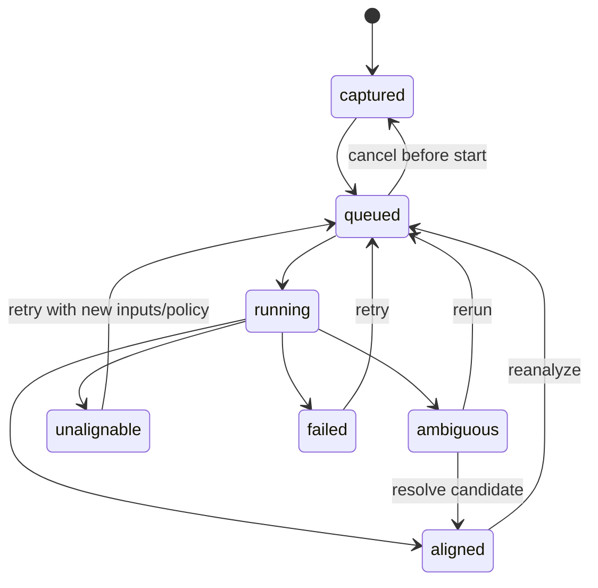
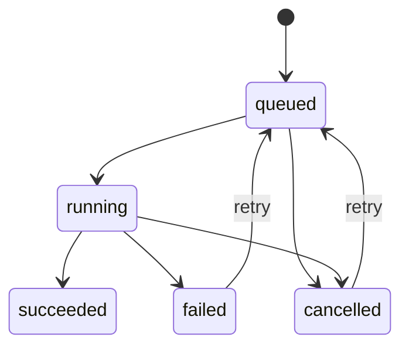

# Lifecycle and Artifact Model v2

**Status:** Runtime integration implemented with v1 compatibility sidecars.

## Why lifecycle is part of the data model

Rubato's durable artifacts participate in three workflows: score-bundle
preparation, rehearsal, and live performance. A single `status` string cannot
truthfully describe all of the independent decisions in those workflows.

The v1 take states mixed:

- an analysis process (`aligning`, `aligned`, `unalignable`),
- the soloist's disposition (`discarded`), and
- eligibility for profile folding.

This caused destructive transitions. Marking an aligned take discarded erased
the fact that it was aligned, so “restore” could not be implemented honestly.
V2 separates independent state axes and pins all derived data to immutable
bundle/timeline revisions.

## Principles

1. **Facts and decisions are separate.** An analysis outcome is a technical
   fact; keep/discard is a performer decision; profile membership is a policy
   decision.
2. **Transitions are commands, not arbitrary field edits.** Services enforce a
   documented transition table and cross-field invariants.
3. **Failures are not musical outcomes.** `unalignable` means the algorithm ran
   successfully and found no credible match. `failed` means software,
   infrastructure, or invalid input prevented a result.
4. **Derived artifacts pin their inputs.** Bundle, timeline, take, and profile
   revisions make stale output detectable and rebuildable.
5. **Raw capture is never destroyed automatically.** Discard and quarantine are
   reversible metadata decisions.
6. **Performance inputs freeze at activation.** A live performance does not
   change interpretation because a background rehearsal fold completed.
7. **Migration is non-destructive.** V2 sidecars coexist with v1 files until all
   readers change together.

## Shared identity seam

Lifecycle documents contain a narrow `BundleRef`:

```text
bundle_id
bundle_revision
timeline_revision
```

The Score Bundle v2 manifest owns the rich bundle contract. Lifecycle code only
requires these immutable identities, avoiding a second bundle schema. During
integration, the bundle loader must produce a compatible reference.

## Take document

`TakeDocV2` stores capture facts plus three independent lifecycle axes:

```text
analysis_state:      captured | queued | running | aligned | ambiguous |
                     unalignable | failed
disposition:         kept | discarded
profile_membership:  pending | included | excluded | quarantined
```

### Analysis transitions



An `aligned` take requires an alignment artifact. A `failed` take requires a
structured failure; other states prohibit failure details.

### Disposition and profile rules

- Discarding preserves the analysis state and forces profile membership to
  `excluded`.
- Restoring changes only disposition. It does not silently re-include old data;
  the fold policy must explicitly set `included`.
- `included` and `quarantined` require a technically `aligned` take.
- A discarded take cannot be included or quarantined.
- `quarantined` means “aligned, retained, but held out by quality/outlier
  policy.” It is not a synonym for failure.

Every real change increments `lifecycle_revision`. Repeating an already-applied
disposition or membership command is an idempotent no-op.

## Stable alignment candidates

V1 resolved ambiguous alignment candidates by list index. Sorting or regenerating
the list could make an old UI action select a different candidate. V2 uses a
stable `candidate_id`, deterministically derived from:

```text
take_id + start_score_tick + source start_position
```

APIs must resolve by ID and reject missing/stale IDs. The hash is identity, not
a confidence or security mechanism.

## Durable background jobs

Jobs have a kind, pinned input revision, attempt count, timestamps, and
structured failure:



Starting a job increments `attempt`. Terminal jobs require `finished_at`.
Failed jobs require structured failure details. Job handlers must be idempotent;
on restart, stale `running` jobs are recovered through an explicit policy rather
than treated as successful.

## Rehearsal and performance runs

Run phase is independent of the engine's performer-facing state word:

```text
preparing -> listening -> active -> stopping -> completed
       \          \          \          \
        +----------+----------+-----------> failed
```

`Listening`, `Following`, `Leading`, `Waiting`, `Recording`, and `Silent` are
ephemeral UI/engine projections and do not belong in take analysis state.

## Event-driven lifecycle projection

Lifecycle documents and managers remain authoritative; WebSocket messages are
typed projections emitted only after an accepted transition or committed
derived artifact. The cockpit takes a REST snapshot on mount and after a
socket reconnect, then applies events until the next reconnect. This avoids
using repeated GET requests as an implicit state machine while remaining safe
when a connection gap misses an in-process event.

The process-wide Yamaha hardware slot has an explicit ephemeral phase machine:

```text
idle -> running -> stopping -> completed
                 \          \-> failed
                  \------------> failed
completed | failed -> running | idle
```

All hardware status changes pass through one transition service. Identical
updates are idempotent, illegal phase edges fail, and every real transition
publishes `hardware:status`. Compatibility fields such as `kind` and
`running` remain in the HTTP/event response, but `phase` owns lifecycle
meaning.

Take analysis publishes `take:alignment_done` after its authoritative take
transition. Profile and coverage work remains a durable job pipeline;
`coverage:materialized` is published only after the coverage artifact is
written and its job reaches `succeeded`. The frontend therefore does not guess
that coverage is ready merely because alignment finished.

`WS /api/events` itself waits concurrently for either a client disconnect or
the subscriber queue. It does not wake on a timer to inspect both sides.
Display clocks, WebSocket reconnect backoff, and the real-time MIDI scheduler
are intentionally separate: they advance time-dependent work and are not
lifecycle polling.

When a performance run enters `active`, it must pin a `ProfileRef` whose bundle
reference matches the run and set `profile_frozen=true`. That reference cannot
change through stopping or completion. Rehearsal runs may operate without a
profile.

## Versioning and migration

The implementation lives in:

- `aimusic.takes.lifecycle`: strict v2 Pydantic contracts and transition
  services.
- `aimusic.takes.migration`: explicit v1 adapters and non-destructive sidecar
  migration.
- `aimusic.takes.store`: authoritative v2 reads/writes, explicit lifecycle
  commands, legacy projections, atomic sidecar writes, and durable job records.
- `aimusic.takes.aligner.AlignmentWorker`: persisted alignment/resolve jobs,
  stale-running recovery, idempotent succeeded-job handling, and distinct
  technical failures.
- `aimusic.takes.materializer.MaterializationWorker`: persisted, deduplicated
  profile and coverage rebuild jobs. Profile jobs pin the aggregate take input
  revision; coverage jobs pin the resulting profile revision. Both recover
  stale-running work at server startup.
- `rubato migrate-takes-v2`: dry-run by default; `--apply` writes
  `take.v2.json` and `aligned.v2.json` atomically.

V1 `discarded` irreversibly hid the previous analysis state. Migration infers
`aligned` only when `aligned.json` exists; otherwise it uses the honest fallback
`captured`. The legacy bundle reference is visibly marked
`legacy-unversioned` / `legacy-score-beat-v1`, so it cannot be mistaken for a
validated Score Bundle v2 mapping.

Sidecars are intentional during the transition. The runtime now dual-reads v2
then v1 and dual-writes compatibility artifacts. It also rebuilds profile and
coverage on alignment/disposition changes; `GET /api/coverage/{movement}` is a
read-only cached view (or an unpersisted empty score view before the first
materialization).

`rubato migrate-takes-v2` prints a dry-run compatibility inventory before any
write, including v1-only, v2-only, dual-write, required-fallback, and alignment
sidecar counts. Apply mode reports the post-migration inventory. The
`ready_to_retire_v1_reads` flag becomes true only when no take requires v1
fallback.

Remaining cutover work is to:

1. Make production Movement 2 bundle loading produce a non-legacy `BundleRef`.
2. Run and retain migration inventory reports on the production take store;
   optionally add runtime counters in addition to the on-disk inventory.
3. Stop writing v1 only after API/frontend consumers use the generated v2
   contracts.
4. Archive v1 metadata after a verified backup and migration report.

## Tests and acceptance

The required contract tests cover every declared transition, illegal
transitions, discard/restore, `failed` versus `unalignable`, profile eligibility,
job retry attempts, stable candidate identity, migration idempotency, and frozen
performance profiles.
