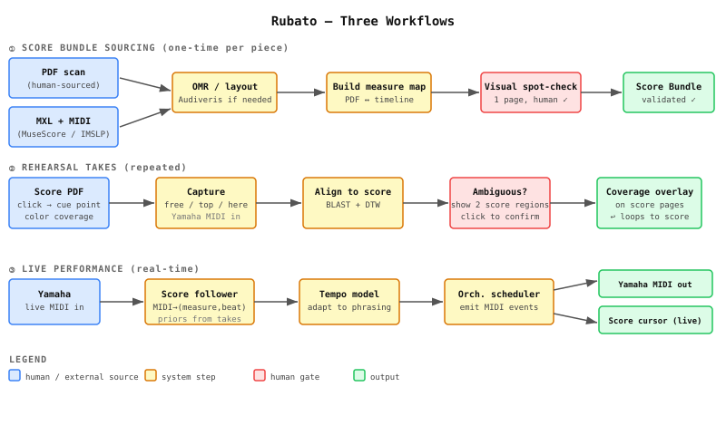
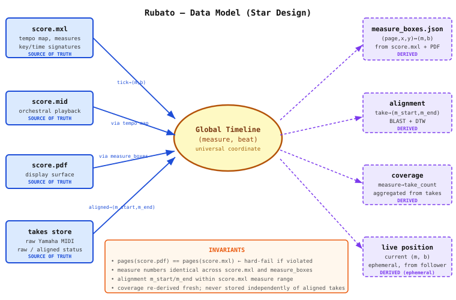

# Rubato Three-Workflow Overview

Rubato is structured around three phases: **Score Bundle Sourcing** (one-time per piece), **Rehearsal Takes** (repeated practice recordings), and **Live Performance** (real-time accompaniment). All phases share a common coordinate system with `(measure, beat)` as the global timeline center.

They have different inference responsibilities:

| Workflow | Inputs | Inference | Durable outputs |
| --- | --- | --- | --- |
| Offline score bundling | PDF, Audiveris MusicXML, reference solo/orchestra MIDI, sparse corrections | Canonical notation states and constraint-bounded symbolic score-to-reference alignment | Score bundle, beat map, PDF geometry, follower/accompaniment references |
| Rehearsal takes | Completed Yamaha take MIDI plus the score bundle | Symbolic take-to-reference alignment, then performed-time/rubato warp | Raw take, alignment, review transport, coverage, interpretation profile |
| Live performance | Incoming Yamaha MIDI plus the score bundle and frozen profile | Causal score position and tempo prediction | Yamaha accompaniment output and diagnostic traces |

The sequence matters. Workflow 2 cannot reinterpret the piece's measure
identity, and Workflow 3 cannot run Audiveris or wait for completed-take
alignment. Rehearsal and live performance share runtime components, but only
rehearsal updates the learned profile after Stop.

## Three Workflows

## Data Model

The data model is a star design. Source-of-truth artifacts (`score.mxl`,
expressive `score.mid`, `score.pdf`, raw takes) map to and from an exact global
`score_tick` timeline, projected as `(measure label, beat)` in the UX. Derived
artifacts (`display_map.json`, alignment, coverage, live position) are always
recomputable from sources. Source MIDI ticks and PDF page coordinates never
become canonical merely because they are numeric; see the
[Score Bundle v2 Contract](../concepts/score-bundle-contract.md).

